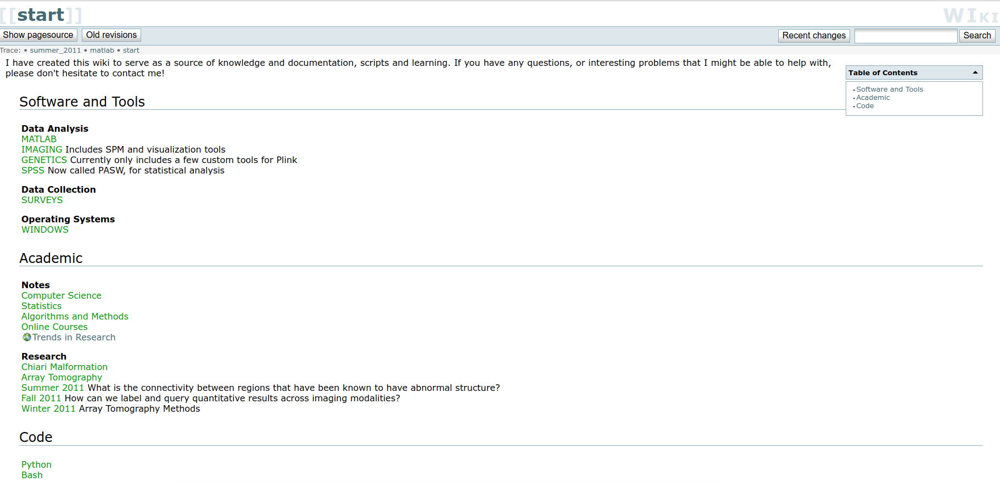

> This is an archive of @vsoch pre-graduate school wiki. It was migrated from DocuWiki and now is just markdown. Original pages are in [pages](pages).

I have created this wiki to serve as a source of knowledge and documentation, scripts and learning.  If you have any questions, or interesting problems that I might be able to help with, please don't hesitate to contact me!

## Software and Tools

### Data Analysis

 - [MATLAB](matlab.md) Tools and Tips for Matlab
 - [IMAGING](imaging.md) Includes SPM and visualization tools
 - [GENETICS](genetics.md) Currently only includes a few custom tools for Plink
 - [SPSS](spss.md) Now called PASW, for statistical analysis

### Data Collection

 - [SURVEYS](surveys.md)

### Operating Systems

 - [WINDOWS](windows.md)

## Academic

### Notes

 - [Computer Science](computer-science.md)
 - [Statistics](statistics.md)
 - [Algorithms and Methods](algorithms-and-methods.md)
 - [Online Courses](online-courses.md)
 - [Trends in Research](http://www.journalogy.net)

### Research

 - [Chiari Malformation](chiari-malformation.md)
 - [Array Tomography](array-tomography.md)
 - [Summer 2011](summer-2011.md) What is the connectivity between regions that have been known to have abnormal structure? 
 - [Fall 2011](fall-2011.md) How can we label and query quantitative results across imaging modalities? 
 - [Winter 2011](winter-2011.md) Array Tomography Methods

## Code

 - [Python](python.md)
 - [Bash](bash.md)
 - [SQL](sql.md)
