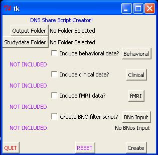
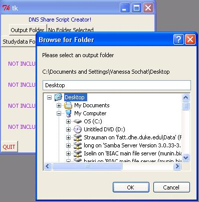
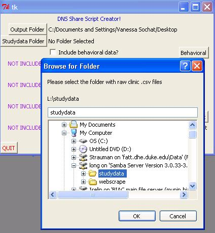
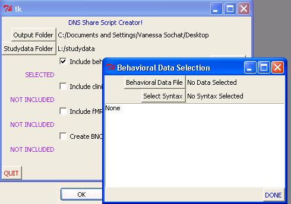
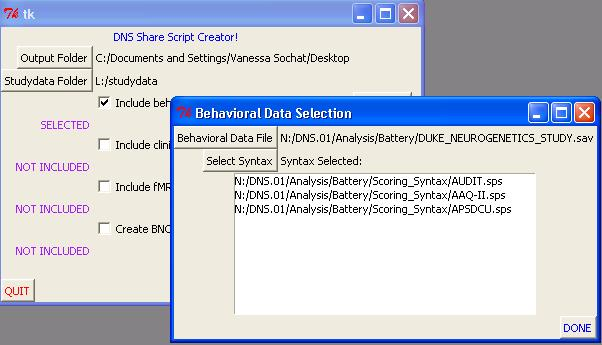
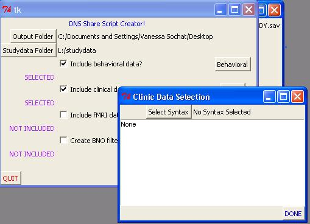
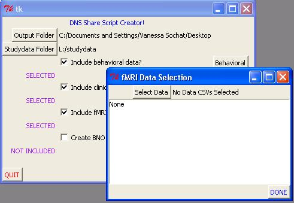
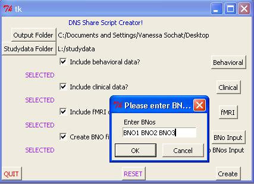

# DNS Share

## Overview

DNS Share is an application that can be used to select behavioral, clinical, and fMRI syntax and data from multiple sources, and create de-identified, scored output SPSS data files to send to collaborators.  While this application is lab specific, the same functionality could be adapted to make other solutions.  



### Output
The application produces TWO .sps scripts in the specified output folder.  The first, DNS_SHARE_DATA.sps, can be opened in SPSS and run to produce all results in the output folder.  The second, dns_collaborator.sps, is used by DNS_SHARE_DATA.sps, and serves as a subject filter to pick out only those subjects requested.  The user can choose to make both of these scripts, or just one of them by using check/selection boxes in the GUI. 

### Input

The application takes .sps scoring syntax for clinic and behavioral measures as input, .csv files of extracted BOLD values, a list of de-identified numbers (BNos) to filter subjects, as well as a specified output folder and studydata folder.  For each modality, there is a separate pop-up for the user to select files, and a check box to indicate that the user wants the modality included.  

The DNS_SHARE_DATA.sps script will produce as many or few of the modalities as desired (fMRI/clinic/behavioral), and all three results will be produced in the .sav (SPSS data file) format.  The files themselves (dns_clinic.sav, dns_behavioral.sav, and dns_neurological.sav) all contain merged results from the many/one syntax or data files selected by the user for each modality, lined up with the appropriate BNos. 

The application can also be run to JUST produce an updated collaborator filter script (dns_collaborator.sps, which is used by the main script). Any modalities, or just BNo filter script, can be included. 

[Download Windows 32 bit](share/dns_share_setup_1.5_32bit.exe)
 
A download for Windows 64 bit will be available after testing!

## Instructions

```
1) Create a collaborator specific folder under Output folder.  
2) Run DNS Share Application 
3) Under DNS Share Application: 
	OUTPUT: Select this collaborator specific folder as the output folder
	INPUT: Check the boxes Behavioral, fMRI, or Clinical if you want to produce output for these modalities
		For each desired modality, click the corresponding button and select for:
			Clinical: Folder with .csv raw files (subjects.csv and clinic_measures.csv) - usually on SSRI
				    Clinic syntax files (under Clinic_syntax)
			fMRI: Group extracted values, usually under N:/DNS.01/Analysis/SPM/Second_level/TIMESERIES/masked
			Behavioral: Raw DUKE_NEUROGENETICS_STUDY.sav behavioral data file (under N:/DNS.01/Analysis/Battery)
					Behavioral scoring syntax under N:/DNS.01/Analysis/Battery/Scoring_Syntax
	BNOs: Check the BNos box if you want to create the filter script.  You can also JUST select this option to only create
		the collaborator filter script.  Click the BNos button and enter your numbers in the GUI.
	RESET: Clears all entries
	QUIT: Exits the GUI
	Create: makes the following:
4) DNS Share application creates:
	A DNS_SHARE_DATA.sps script (which you can run to produce all desired output)
      a dns_collaborator filter script - also created by DNS Share application - contains subjects BNos of interest
  		Whenever a collaborator changes this list, this syntax will need to be updated.  You can use the DNS_Share application
            to make a new dns_collaborator script, or (insert matlab script name here)
            If you change the name of the file, make sure the name is also changed in DNS_SCORE_DATA.sps under the collaborator FILE HANDLE.
	A folder called "temp" in the output directory for temporary files.  It is suggested that you delete temporary files after each run.

5) Open DNS_SHARE_DATA.sps in SPSS/PASW and click Run --> All to create your output	
```

THIS APPLICATION IS STILL IN BETA TESTING PHASE!

Select output folder



Select study data folder



Select Behavioral Data



Select Clinical Syntax



Select fMRI data



Input BNos



Any modalities, or just BNo filter script, can be included. 


