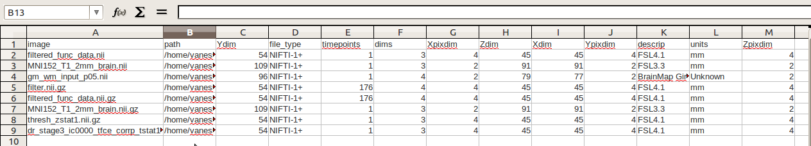

# MRLOG

## OVERVIEW
MRlog is a python script that uses fsl or nibabel to print a log for nifti (.nii and .nii.gz) files.  For nibabel, it requires [MRtools](mrtools.md) (a python script that works as a module) to be in the same folder.  It was created with the [melodic dual regression](melodic-dual-regression.md), although it only requires the MRtools script to run. The output text file can be opened in excel, for example:



## Usage

```bash
MRLog: prints log of imaging data information found in a particular directory.
FSL is used by default, expected to execute on command line as "fsl." To use
nibabel, make sure MRtools is in same folder, and specify --sof=nibabel

 
OPTIONS:
  -h, --help             show this help  
  -d, --dir              path to top data directory
  -s, --sof              software to read (fsl or nibabel)
  -o, --out              output folder for log
                         if not specified, uses pwd
USAGE:
python MRLog.py --out=/path/to/out --dir=/path/to/Data

OUTPUT: 
image,path,Ydim,file_type,timepoints,dims,Xpixdim,Zdim,Xdim,Ypixdim,descrip,units,Zpixdim, (fsl)
image,path,dims,units,Xpixdim,ydim,Zpixdim,file_type,zdim,timepoints,xdim,Ypixdim, (nibabel)
```

## Scripts

For the [MRtools script](https://github.com/vsoch/ica-/blob/master/MRtools.py), and the [MRlog script](https://github.com/vsoch/ica-/blob/master/MRlog.py).
If you are interested in MRtools as a module for reading, filtering, and matching images, see [MRtools](mrtools.md).

### Plans for next release

  - Allowing for prefix search
  - Additional data types
