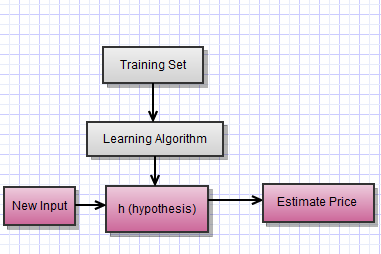

# Supervised Learning

**Definition:** Supervised learning is using inputs (predictors, features, independent variables) to predict outputs (dependent variables, responses).  These outputs can be quantitative or qualitative.  

**Output Types (Y):**
  - regression: when we predict quantitative outputs (Y)
  - classification: when we predict qualitative outputs (G)

**Input Types (X):**
  - qualitative: use numerical variable represented by codes (male/female --> 0/1).  These codes referred to as "targets."
  - the input type commonly guides the method
  - ordered categorical (small, medium, large)

**Annotation:**
  - observed values written in lowercase (x)
  - matrices are bold uppercase letters

**Goal:** Given the value of an input vector X, make a good prediction of the output Y, denoted "Y hat."  We use training data (a set of inputs and their output) to come up with our prediction rule.

You provide the algorithm with an actual data set and outcomes.  Allow the algorithm to learn the association between the input and output to come up with right answers.

== Learning to Predict Housing Prices ==
You can plot two related variables, like house prices vs square footage, on an x and y plane.  Let's say that we wanted to come up with a house price and predict the square footage.  We could assign a best fit line to the data, 

[Classification Problem](classification-problem.md)

## Notation

  * m: number of training sets (x,y)
  * x: input feature
  * y: output



Linear equation to represent hypothesis:  Θi = theta - are called the parameters of our learning algorithm.  They are real numbers. It is the job of the learning algorithm to choose appropriate thetas for the problem.

``` 
h(x) = Θ0 + Θ(1)x

If we have more than one feature (x1, x2, etc):
h(x) = hΘ(x) = Θ0 + Θ1x1 + Θ2x2
```

Given a house with features, x, this is the price hΘ(x) that the equation predicts based on the features x1, x2, etc.
```

For conciseness, define x0 = 1
h(x) = sum(from 0 to 2) of Θixi = Θix
```

If n is the number of features in the learning problem, this becomes  sum from i=0 to n.
