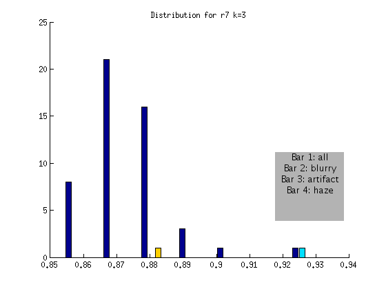
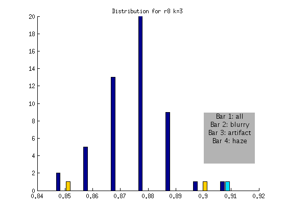
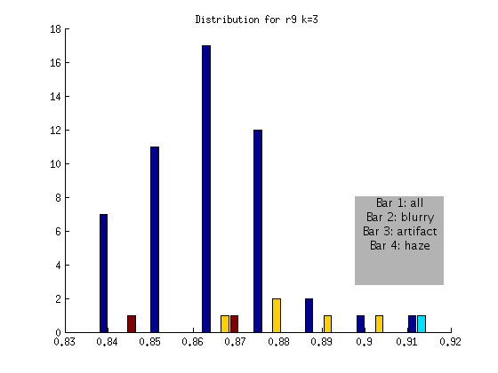
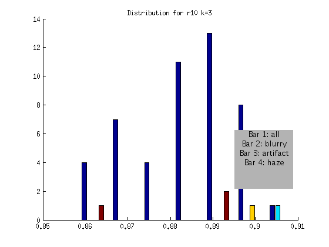

# Winter 2011

## OVERVIEW

I am excited to be rotating with [Smithlab](http://smithlab.stanford.edu) working on methods for array tomography

[img/DAPI-040_tile-000.png](img/DAPI-040_tile-000.png)

**Planned Steps** 

 1) Read each zvi file in directory  
 2) figure out which images correspond to ZAPI channel (RLFiltPos) 
 3) For each DAPI, calculate autocorrelation function, can do just x 
 4) take image and shift, graph for all 

### FEBRUARY 5

Our next goal is to test this threshold on a number of new datasets.  I downloaded 6 new datasets, created the tif images, and started to look at the acf functions when I realized that I was not extracting the correct channel.  Looking back at my original zvi_Reader script, I had not created the functionality to select channels, and so I added a function to get a channel number for a name, and then create tif images based on that channel.  There are multiple ways of going about it:

<code>
# Look at summary of image
images.zvis[0].summary()

# Look only at channel dictionary
images.zvis[0].channeldict
{0: 'DAPI', 1: 'vGluT1(GP)', 2: 'GAD67(Ms)', 3: 'PSD95(Rb)'}

# Look up an index based on a name
images.zvis[0].getChannelNum('GAD67(Ms)')
2

# Save a tif based on looking up an index
images.zvis[0].saveTif('/home/vanessa/Desktop/',images.zvis[0].getChannelNum('GAD67(Ms)'))

# Or if you know the index already
images.zvis[0].saveTif('/home/vanessa/Desktop/',2)
</code>

### JANUARY 26

As a reminder, we are testing the hypothesis that we can use the autocorrelation function for a shift of k=3 pixels to identify globally blurry DAPI images.

I manually curated all four datasets (r7,r8,r9,r10) and marked each image for blurriness, an artifact, or haze in each quadrant.  When we plotted the distribution to show these images, it was apparent that I was too stringent, and had marked many images for which it was arguable if they had blurriness in one small corner.  We decided to again talk about our goal for the current algorithm, which is to automatically detect images that are blurry, across the entire image.  With this in mind, I generated the distributions to create a confusion matrix for the blurry images that we would miss:

<code>
r7             FLAGGED
               Blurry ~Blurry
ACTUAL Blurry  1      0
       ~Blurry 0      49
</code>
I should note that the one image that is > .9 is not in fact blurry, but has a subtle artifact going through one quadrant.  This means that while it would have been flagged (for the artifact) it is not blurry!

<code>
r8             FLAGGED
               Blurry ~Blurry
ACTUAL Blurry  1       0
       ~Blurry 0       50
</code>

<code>
r9             FLAGGED
               Blurry ~Blurry
ACTUAL Blurry  1       0
       ~Blurry 0       50
</code>

<code>
r10             FLAGGED
               Blurry ~Blurry
ACTUAL Blurry  1      0
       ~Blurry 0      47
</code>

Based on the above, an algorithm to detect globally blurry images based on an absolute threshold of > .9 at a shift of k = 3 would successfully tag the very blurry images for the DAPI channel.  This method would not include artifact or "hazy" images, represented by the other bars.  We will develop additional checks for these issues!

We also discussed how blurriness in one corner is a different issue.  It has less to do with autofocus, and more to do with the angle of the sample on the plate compared with the resin, etc.  In this case, refocusing would not fix the problem, and thus a different kind of alert would be needed.  We talked about applying the same algorithm, but first breaking the image into four quadrants.  A quadrant that looks significantly different than the others could be flagged as either artifact or blur as a result of improper positioning.

======JANUARY 17======

We think that looking at the autocorrelation function around the 8th pixel will allow us to set a threshold to pick out both blurry and artifact images. The first strategy we decided to try was to flag images that were a certain number of standard deviations above the median.  To do this, we would need to look at the distribution of different k values across images for an entire ribbon, and then look for consistency between ribbons.  To do this, I first extracted data from the images using the following two matlab scripts:

 

I then wrote a matlab script to write the data from a ribbon to text file so I could easily load into R

[printZVIShift.m](https://raw.githubusercontent.com/vsoch/vbmis.com/master/projects/smith/printZVIShift.m)

This resulted in the following four data files for ribbons [k-16-vals_r8.txt|r7](https://raw.githubusercontent.com/vsoch/vbmis.com/master/projects/smith/printZVIShift.m),[k-16-vals_r8.txt|r8](https://raw.githubusercontent.com/vsoch/vbmis.com/master/projects/smith/printZVIShift.m),[r9](https://raw.githubusercontent.com/vsoch/vbmis.com/master/projects/smith/k-16-vals_r9.txt),and [k-16-vals_r10.txt|r10](https://raw.githubusercontent.com/vsoch/vbmis.com/master/projects/smith/k-16-vals_r9.txt) respectively.  My plan was to create these files for use in R, however at the end of the day I wound up moving back to matlab for a little more power in creating graphs.  I am still not great with R.  For documentation's sake, however, here is the R code to look at a distribution, and prepare the data with a blurry (yes=0, 1=no) field.

<code>
r8 = read.table('k-16-vals_r8.txt',sep=',',header=TRUE)
# Identify index of blurry image, ...100040.zvi.tif:
r8$filename[41]
[1] r7ct2_r7_stain1-0003_100040.zvi.tif

# Create an array of labels for 50 images, mark blurry image as 0
blurry = rep(1,50)
blurry[41] = 0

# Merge into one data frame, and get rid of empty extra row in r7
test = cbind(r8[1:17],blurry)
r8 = test

# Look at the distribution
hist(r8)
</code>

Realizing that I wanted to create complicated plots (that was above me in R) I scrapped that and moved to matlab! As a reminder, for k=1:16 we want to look across each set of images, find their correlation at that offset that is a distribution of values, find its median and its standard deviation, then plot out the histogram, mark the blurry ones, and then look for consistency between datasets.  This will determine what is the threshold in units of standard deviation.  I did this for r7,r8,r9,and r10 - creating both native and standardized distributions with the following script:

[zviKHist.m](https://raw.githubusercontent.com/vsoch/vbmis.com/master/projects/smith/zviKHist.m)

The commands would be:
<code>
zviKHist(r7,'r7',[39],[1,16])
zviKHist(r8,'r8',[42],[1,16])
zviKHist(r9,'r9',[24,47,49],[1,16])
zviKHist(r10,'r10',[19],[1,16])
</code>

to produce the following (not normalized) distributions:

and the following normalized distributions:

I should note that these are all DAPI images.  The red line represents the "most blurry" image that I visually selected from each dataset of ~50 images.  The blue line represents the median, and this was used as the measure of central tendency.  Given that I selected only the most blurry, it might be the case that there are slightly less blurry images in each set.  I should also note that the blurry image identified in ribbon 9 (r9) was the blurriest of all.

**A Summary of My Observations**

  - Looking at the Z values of the blurry images between ribbons, it is clear that each one can be distinguished from the rest at some value of k, however the values of k vary between the ribbons.
  - r7: is the hardest case because it is only slightly blurry.  Small values of K look ok in the distribution, and we only see >1SD at k>12
  - r8 and r9: blurry images could be identified as an outlier from k=1 through k=12
  - r10: is interesting, because it is at the extreme from k=1:4, but then looks like a normal image in the set 

**Next steps...** 

  - **BLURRY DETECTION**: We should pick out specific (multiple) values of K with thresholds, and create a filter to run on our current data, and then new data sets.  We might consider comparing this method with just picking out a fixed value for those same values of k.  
  - **ADDITIONAL ARTIFACT DETECTION**: When the method above is established, we discussed splitting the image into quarters and doing the same thing on each quarter.  We suspect that at least one of the quarters would be artifact free, and thus the functions would look different within the same image (and would be flagged for artifact).  We would need to be careful to cut the image in a way as to not remove all the DAPI staining, and so Forrest suggested that we first check the overall brightness of the quarter piece, and to possibly do cuts of 4 in multiple orientations.
  - **TOOLIZE**: When the threshold value and method is set, I would then like to move this into python and create a UI to perform both tasks simultaneously, and alert the user when a bad image is found, display the image, and give an option for retake.

### JANUARY 9

We are finally set up to look at multiple DAPI ribbons and better classify a blurry versus a clear image.  Forrest has instructed to focus on the shifts from 0-16 pixels because, as is shown in the charts below, this area best distinguishes blurry from clear. The current goals that I am working on are as follows:

**Goals**

 1) Look at correlations for more imaging sets
 2) Identifying large artifacts
 3) Distinguishing image with large artifact from blurry image with artifact

**Procedure**

 - **1)** To better understand what a blurry image looks like from an autocorrelation plot I have downloaded, created tifs for, and created plots for 3 additional image sets, and additionally created artificially blurry images. To do this, I used zvi_Reader to save tifs from zvis as follows:

<code python>
import Image
import os
import zvi_Reader
images = zvi_Reader.zviReader('/home/vanessa/Documents/Work/ARTom/ZVI_IMAGES/r7')

for zvi in images.zvis:
    zvi.saveTif('/home/vanessa/Desktop/zvi_tif/r7')
</code>

I then manually looked through each to identify blurry images:

**r7:** 

r7ct2_r7_stain1-0003_100036.zvi [REALLY BLURRY] 
r7ct2_r7_stain1-0003_100006.zvi [A LITTLE?] 
r7ct2_r7_stain1-0003_100008.zvi [A LITTLE?] 

**r8:** 

ct2_r8_stain1-0001_100040.zvi 

**r9:** 

ct2_r9_stain1-0037_100022.zvi 
ct2_r9_stain1-0037_100045.zvi 
ct2_r9_stain1-0037_100048.zvi 

**r10:** 

ct2_r10_stain1-0042_100017.zvi 

I then plotted each new distribution, with "ok" images in yellow, and blurry images in red, as follows:

<code matlab>
% from directory with images
listing = dir(pwd)
hold on

% Plot acf for every image
for i=3:length(listing)
runacf(listing(i).name,80,2,'y');
end

% Plot acf for blurry image(s) in red 
runacf(listing(39).name,80,2,'r');
</code>

**Ideas about how to distinguish blurry from regular images:** 

- Threshold > .85 at 5 pixels 
- Calculate a mean equation for the lines, then a distance metric away from it at some threshold 
- Figure out slope of line between 1 and 16 pixel shift, blurry images slope isn't as steep? 
- Calculate mean value for entire sequence at 3,4,5, and flag images > some threshold from that value? Note: Could lead to error if an entire set is blurry. 
- Identify SHARPEST image (with steepest slope) at multiple points, and ID blurry images based on distance from this image 

If we are only looking at pixels 1 through 16, is it worth skipping every other one?

**2)** To distinguish an image with an artifact from the equivalent blurry image, I have artificially created blurry images of artifacts.
Forrest hinted that "blur should be everywhere and artifacts have a spatial variation."  Here is the acf for one artifact image, increasing in blur from left to right:

I then added the rest of the series, for comparison:

The first issue is distinguishing an artifact from the rest of the images.  The second issue is distinguishing a blurry artifact from a non-blurry artifact. I don't think that I have a good idea of how to distinguish a "sharp" artifact from a "normal" sharp image, so I need to identify and plot more of these for next time.

**FOR NEXT TIME:** 

  - Decide on a few techniques to try to distinguish blurry from clear, and test on datasets
  - Get better idea of how to distinguish artifact from normal

### JANUARY 5

Forrest figured out the correct call to make with Image.frombuffer to create a tif:

<code python>
# Use python Image module to save image
        image = Image.frombuffer('L',(1388,1040),imagelist,"raw",'I;16',0,1)
        image.save(directory + self.file + ".tif", "TIFF")        
</code>

I then proceeded to make all the images for my folder of zvi files, and next I am going to look at the autocorrelation functions for each of the images.  I am going to go through the images with fiji, manually identify the blurry ones, and then color their autocorrelation functions differently to see if there is any sort of pattern.

The following images I identified as...

**Blurry** 

ct2_r8_stain1-0001_100040.zvi (very much so) [BLUE] 

**Large Artifact:**  
ct2_r8_stain1-0001_100022.zvi [RED] 

**Line:** 
ct2_r8_stain1-0001_100035.zvi [PINK] 
ct2_r8_stain1-0001_100000.zvi [PINK] 

Here is the autocorrelation function for all images, with the obviously blurry image in blue, large artifact in red, and lines in pink. 

{{http://www.vbmis.com/bmi/project/smith/zvi/acf2px.png?500}}

### JANUARY 1

I am trying to better understand different ways of saving images with the PIL.  I think that I am either not using Image.frombuffer correctly, OR I am somehow extracting data for all the channels, when I only want one.  As usual I am starting with:

<code python>
import Image
import os
import zvi_Reader
images = zvi_Reader.zviReader('/home/vanessa/Documents/Work/ARTom/r8')
path,filename = os.path.split(images.zvis[0].path)
imagename,tif = os.path.splitext(filename)
imagelist,height,width = images.zvis[0].ole.readImageItemContentsStreamBuffer("Image/Item(%d)/Contents" % 0)
test = Image.frombuffer('I;16B',(1388,1040),imagelist,'raw','I;16B',0,1)
</code>

I tried [[http://www.pythonware.com/library/pil/handbook/concepts.htm|different modes]] with Image.frombuffer, and all of the resulting images were incorrect.  I then read some data from the header of one of the images:
<code>
(Version,Width,Height,Depth,PixelWidth,PixelFormat,ValidBitsPerPixel)
(268443648, 1388, 1040, 1, 2, 4, 16)
</code>
I'm not sure what "version" and pixel depth and format are.

### DECEMBER 27

To create an image with PIL, we need a buffer or a string.  Instead of taking the list returned from the ole object, Forrest suggested that I use the string / buffer before it is unpacked with struct.  So I edited OleFileIO_VS and created a new function, readImageItemContentsStreamBuffer(filename), which will return the string / buffer.  On the back end of the script, I created a new function called readImageItemContentsStreamGeneric, which is called by both: 

<code python>
readImageItemContentsStreamBuffer(filename) returns imagebuffer,width,height
readImageItemContentsStream(filename) returns imagelist,width,height
</code>

Sample usage, to read in a zvi file and save tiff image to file:
<code python>
import Image
import os
import zvi_Reader
images = zvi_Reader.zviReader('/home/vanessa/Documents/Work/ARTom/r8')
path,filename = os.path.split(images.zvis[0].path)
imagename,tif = os.path.splitext(filename)
imagelist,height,width = images.zvis[0].ole.readImageItemContentsStreamBuffer("Image/Item(%d)/Contents" % 0)
test = Image.frombuffer('I;16B',(1388,1040),imagelist,'raw','I;16B',0,1)
test.save('/home/vanessa/Desktop/new.tif', "TIFF")
</code>
The image is definitely ok looking (the data is there!), but appears to be off in terms of levels, so my next step is to test different modes and filetypes.  It could be the case that the buffer I am using with data is not completely correct.

### DECEMBER 25

Overview: I am working on reading in a zvi file, and saving images to file as tif exclusively with python (no fiji or jython!)  I tested a few image manipulation modules in python, and Forrest and Nick have advised to stick with PIL (Python Imaging Library).  Here is my first try:

<code python>
# Set up environment with zvi_Reader objects and PIL module:
import Image
import os
import zvi_Reader

# Use zvi_Reader to find all zvi files in directory, and create zvi object for each
images = zvi_Reader.zviReader('/home/vanessa/Documents/Work/ARTom/r8')
path,filename = os.path.split(images.zvis[0].path)
imagename,tif = os.path.splitext(filename)

# Read image data from ole object inside zvi object
imagelist,height,width = images.zvis[0].ole.readImageItemContentsStreamBuffer("Image/Item(%d)/Contents" % 0)

# Read in a sample tiff file (created with fiji) to get the mode and size that we should use:
pilImage = Image.open('/home/vanessa/Documents/Work/ARTom/DAPI/DAPI-040_tile-000.tif')
pilImage.mode
'I;16B'

pilImage.size
(1388, 1040)

# Try creating a new image based on these parameters
# Also takes an optional third variable, color. Unspecified means image is filled with black
test = Image.new('I;16B',(1388,1040))

# Imagelist contains single ribbon of pixel values, the "data" for the image
# Try using frombuffer to fill data into new image, first give as is:
test = Image.frombuffer('I;16B',(1388,1040),imagelist)

__main__:1: RuntimeWarning: the frombuffer defaults may change in a future release; for portability, change the call to read:
  frombuffer(mode, size, data, 'raw', mode, 0, 1)
Traceback (most recent call last):
  File "<stdin>", line 1, in <module>
  File "/usr/lib/python2.7/dist-packages/PIL/Image.py", line 1853, in frombuffer
    core.map_buffer(data, size, decoder_name, None, 0, args)
TypeError: expected string or buffer

# Force it into a string...
test = Image.frombuffer('I;16B',(1388,1040),str(imagelist))
# "Works," however when we do test.show(), it is just whiteness... can't be right!

# Next, extract data from a "good" image (the tiff above) to see what it is supposed to look like
data = list(pilImage.getdata())
# Note that when it is converted to list, it looks exactly like imagelist

pilImage.save('/home/vanessa/Desktop/original.tif', "TIFF")
test.save('/home/vanessa/Desktop/new.tif', "TIFF")
</code>

The original image is fine, but something is weird with the test image.  It seems that the crucial step is "loading" in the data, so I decided to work backwards and try extracting the data from the test image...

<code python>
# Here is the extracted data, datatest[1:10]
[14132, 14380, 8247, 13110, 11296, 14131, 13100, 8247, 14392]

# Here are what the values should be, imagelist[1:10]
[340, 337, 332, 330, 332, 320, 311, 342, 347]
</code>

so I concluded there was a problem with the format of the data I was using to create the image, since it was asking for a string or a buffer.  Forrest has suggested that I go back to the ole object and grab the data buffer before unpacking it with struct.

### DECEMBER 25

**Goal:** I am working on calculating the autocorrelation function for my DAPI channel image.  My goal is to plot the distribution to find a pattern that might be used to distinguish blurry from clear images.

Since matlab is a little easier than python for quick and dirty work, I have decided to use it first to understand autocorrelation and the distributions, and then move to numpy.  I found [[http://shadow.eas.gatech.edu/~jean/paleo/Meko_Autocorrelation.pdf|this PDF]] to be very helpful for understanding how to code autocorrelation.

I had expected the chart to have a sharp peak and quick drop off, and largely this is what I see, although the drop off is not as steep as I expected.  Here is the chart for k=600, created from the DAPI image above.  I should note that I forgot to scale this into the range -1 to 1, so just ignore that for now :P

The idea behind this is really cool.  Autocorrelation basically means an image's correlation with itself at small time (pixel) shifts.  If we took an image, copied it, and laid it exactly on top of itself, the correlation would be 1, of course.  And then if we shifted it just a little bit, it might still be high, but start to drop.  So if you can imagine a blurry image, I would suspect that this chart would have higher correlation values even with little shifts, because the blurriness makes neighboring pixels more similar.  A sharp image, on the other hand, would have a tiny shift and very different values in that small shift.
  
<code matlab>
to run:
% corvals = runacf('tif_image',k)
corvals = runacf('DAPI-040_tile-000.tif',k)
</code>

My next goal is to look at a LOT of these distributions, and figure out how to distinguish blurry from sharp images.  Before I do that, however, I need to move the functionality to save a tif image from jython/fiji into just python.

### DECEMBER 23

**Goal:** We talked about future implementation for this script, and it was decided to try and move the zviReader functionality out of Fiji/jython and into python (Section 1: Jython --> Python), and then it would be possible to do autocorrelation (Section 2: autocorrelation) with numpy (Section 3: numpy).

**Section 1: Jython --> Python** 
The OleFileIO_PL.py script that functioned in jython produced the following error in python: 

<code python>
Traceback (most recent call last):
  File "<stdin>", line 1, in <module>
  File "OleFileIO_PL.py", line 804, in __init__
    self.open(filename)
  File "OleFileIO_PL.py", line 992, in open
    self.loadfat(header)
  File "OleFileIO_PL.py", line 1164, in loadfat
    self.loadfat_sect(sect)
  File "OleFileIO_PL.py", line 1140, in loadfat_sect
    s = self.getsect(isect)
  File "OleFileIO_PL.py", line 1277, in getsect
    self._raise_defect(DEFECT_FATAL, 'incomplete OLE sector')
  File "OleFileIO_PL.py", line 822, in _raise_defect
    raise IOError, message
IOError: incomplete OLE sector
</code>
To troubleshoot, we decided to narrow it down to the language (jython vs python) versus the OS (Windows vs linux).  I tried reading in a simple text file in both Windows and Linux, to determine if it was the OS, and got the same result to ultimately conclude it is something about the code and the jython vs. python environment:

<code python>
# Passing a text file in both Windows/Linux we get the same message, it's not an ole2 file:

Traceback (most recent call last):
  File "<stdin>", line 1, in <module>
  File "OleFileIO_PL.py", line 804, in __init__
    self.open(filename)
  File "OleFileIO_PL.py", line 854, in open
    self._raise_defect(DEFECT_FATAL, "not an OLE2 structured storage file")

  File "OleFileIO_PL.py", line 822, in _raise_defect
    raise IOError, message
IOError: not an OLE2 structured storage file
</code>

Next it made sense to look at differences between the variables read from the file header.  The main difference was the itemsize variable - for python it was 4, and for jython it was 8.  The variables numlines, length of sector, and nbsect were the same.  A bigger clue came when the indices themselves were print out:
<code python>
index        0      1          2          3 ....  
jython   0:        0      2C8          58C  
python   0:        0      C8020000 8C050000  
</code>

Whoa!  Those are very different.  I saw the same numbers in a different order, and at this point Forrest sent me an old unmodified version that had worked in python, and suggested it might be something about "big" versus "little" endian. I had absolutely no idea what this meant, so I looked it up.  It looks like "endian-ness" is talking about the way that bytes are ordered, with "big" putting the big ones first, and "little" putting the small (less significant ones) first.  I would speculate this may be the problem, because in the case of both working scripts the bytes are ordered like "2C8" and "58C" (little endian?) - and the non-working python version has "C8020000," and "8C050000" (big endian?).  The next question would be, what is the default for python versus jython?  I looked this up for python, and it looks like python will use whatever the system's default is.  To see what my system was using I did:
<code python>
import sys
sys.byteorder
'little'
</code>

to see that it is using little endian on my computer with python. I then found a modification in the jython script that was forcing use of big endian, and concluded that was the problem.  And indeed, changing it back to use little endian fixed the error, and allowed me to read in the image.  Success!

**Section 2: Autocorrelation** 

The idea of autocorrelation seems to be to pancake two images on top of one another, and move x units in each of 4 directions, and calculate a correlation for each shift.  It is like doing a correlation between different timepoints of two images to find repeating patterns.  The idea is that it might be a useful method to detect blurry images, because with a sharp image you shouldn't see repeating pixel values with a small shift in some direction, and with a blurry image you would.  This of course depends on the type of image that is being looked at.  For this particular problem, we are going to be using the "DAPI" channel (image above).

**Section 3: Numpy** 
in progress!

### DECEMBER 19

**Previous Goal:** to familiarize self with "OleFileO" and "zviUnpack" scripts.  I did the following: 
 1) Installed [[http://fiji.sc/wiki/index.php/Fiji|Fiji]] and found the jython interpreter 
 2) Learned how to add OleFileO as a Fiji plugin, added it 
 3) Tested zvipackall_seq within interpreter (see questions) 
 4) Successfully extracted one image (see top of page) and created [[http://www.vbmis.com/bmi/project/smith/zvi/histogram.png|histogram]] 
 5) Wrote bare bones class "zvi_Reader" to read and save a list of zvi objects, for easy manipulation in the interpreter 
 6) Added method hist() to print a simple image histogram, and summary() to summarize data fields / each zvi object 
 7) Added class to plugins folder for jython interpreter to find 

**Meeting Objectives:** 
 1) First review work above 
 2) I want to get a sense of each data field so I know what to work with when calculating cross correlation 
 3) How to install other modules within their interpreter? (numpy, etc) 
 4) Questions about ZviUnpackall (below) 
 5) Establish goals for next meeting! 

**Questions about ZviUnpackall:**

**1)** Why do we set a directory string, and then ask for one again?  How does this work? (I tried it out and it wasn't obvious) 
**2)** Why is there a u' at the start of strings? For example: 
<code python>
>>> upone
u'/home/vanessa/Documents/Work/ARTom/r8/'
</code>

**3)** What does "assert" do?
<code python>
assert OleFileIO_PL.isOleFile(self.zviImage)
</code>

**4)** Is there potential for division by zero (at least in image I was testing)
<code python>
numchannels = numimages / (MosaicSizeX * MosaicSizeY);
</code>	

**5)** So when run as a script, we manually select zvi images, and extract metadata?  How does this relate to the "run" function (I want to get a better idea of the order of operations, or different ways to run...)  Is there a difference between using this script as a class versus just running?

**6)** Can we talk about threads / producer? Producer seems to be where the zviUnpack class is called to write tiff images to file.  I've never used threads before, how does called start() get things going?

**7)** What is significance of "_1" in numtag?  Also, generally, what is naming and organizational scheme for images?

**My Understanding of the Task:**
There is a "ribbon" of slices that goes under a microscope to get a series of images (all in one zvi file) for each stain. If there are 30 brain slices on a ribbon, each one of those slices might have four images taken, corresponding to 120 images taken per ribbon.  In the case of a blurry images, the user would want to be alerted, and all of the "flagged" images re-taken automatically.  The goal is to come up with an efficient algorithm to both flag and retake, and then integrate this into the current pipeline.  Another issue that will influence how the retaking of images is implemented is registration.  Within the four images of one brain slice there is slight overlap around the edges for registration, and it is not clear if retaking only 1/4 of the images will ruin the registration (and thus for any one blurry image, we would need to retake all 4 in the set).

**My Understanding of the Tools:**

We are using Fiji (ImageJ) because it is open source, has many user generated image processing scripts, allows for use in multiple languages, and therefore is good for easy user development. 

Lastly, here is an example print out of the information obtained about a zvi object from the summary() function:
<code python>
file: ct2_r8_stain1-0001_100040.zvi
directory: /home/vanessa/Documents/Work/ARTom/r8
path: /home/vanessa/Documents/Work/ARTom/r8/ct2_r8_stain1-0001_100040.zvi
channels: [0, 1, 2, 3]
XPos: [(17023.5,), (17023.5,), (17023.5,), (17023.5,)]
YPos: [(816.0,), (816.0,), (816.0,), (816.0,)]
XCoors: [-1, -1, -1, -1]
YCoors: [-1, -1, -1, -1]
FocusPositions: [(988.5500000000001,), (988.5500000000001,), (988.5500000000001,), (988.5500000000001,)]
Exposure Times: [95.784, 665.576, 569.792, 677.242]
RLFiltPositions: ['Dx00Ax00Px00Ix00x00x00', 'Cx00yx00_x005x00x00x00', 'Tx00ex00xx00ax00sx00_x00Rx00ex00dx00x00x00', 'Fx00Ix00Tx00Cx00x00x00']
channeldict: {0: 'DAPI', 1: 'GAD6567_647', 2: 'VGlut2_594', 3: 'VGAT_488'}
channelnumbers: [0, 1, 2, 3]
Width: 1388
Height: 1040
MosaicSizeX: 0
MosaicSizeY: 0
ScaleFactorX: 0.102380952381
ScaleFactorY: 0.102380952381
ole: <OleFileIO_VS.OleFileIO instance at 0x96fafec>
</code>

### DECEMBER 13

1) Obtained [code](http://code.google.com/p/smithlabsoftware) 
- OleFileO - reads zvi files 
- zviunpack_seq - plugin for fiji 
